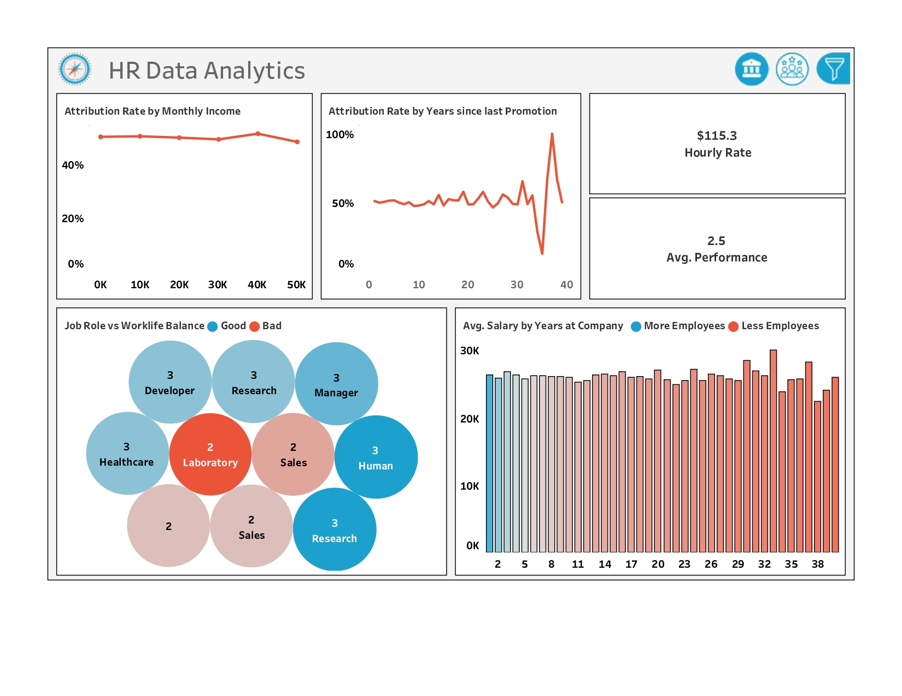

# Data Analyst, BI Analyst

**Contact Information:**
- **Phone:** +91 9082292185
- **Email:** [souvik.biswas@outlook.in](mailto:souvik.biswas@outlook.in)
- **LinkedIn:** [linkedin.com/in/analyst-souvik](https://linkedin.com/in/analyst-souvik)
- **Location:** Mumbai, MH 401105

## Profile Summary:
Analytical BI / Data Analyst with a six-month internship at AI Variant and a degree in Computer Science Engineering. Skilled in data visualization, ETL, and dashboard creation, ready to add value to any dynamic team.

## Skills:
- **Technical Skills:** ETL, Data Visualization, Dashboard Creation, Basic Python and Statistics
- **Soft Skills:** Communication, Critical Thinking, Presentation, Project Management, Requirements Gathering
- **Tools & Technologies:** Advanced Excel, Power Query, Power BI, Tableau, MySQL

## Work Experience:

**AI Variant**  
*Data Analyst Intern*  
*Oct 2023 – April 2024*
- Collaborated with the team to ensure proper ETL processes using Power Query, creating impactful reports and dashboards with Excel, Power BI, and Tableau.
- Proficient in utilizing Pivot Tables and executing SQL queries to derive meaningful insights. Acquired expertise in Microsoft Fabric, data gateways, and data governance, ensuring adherence to best practices in data management.
- Enhanced proficiency in data presentation, integration, modeling, normalization, redundancy resolution, and problem-solving through immersive projects and mentorship.
- Used visualizations and forecasting to anticipate trends, identify issues from KPIs, and provide recommendations for informed decision-making.

## Projects:

### 1. Bank Loan of Customers

**Objective:**
To enhance risk management and lending strategies by providing detailed insights into loan balances, payment behaviors, and loan statuses across various demographics and verification statuses.

**Key Contributions:**
- Analyzed loan data to identify trends in loan amounts and payment histories.
- Created visualizations and reports that helped the company optimize loan offerings.
- Improved customer segmentation strategies by providing detailed demographic insights.

**Tools Used:**
- ETL using Power Query
- Excel
- Power BI
- SQL

**Outcome:**
The insights derived from this project supported strategic decision-making, enabling the company to improve its lending strategies and manage risks more effectively.

### 2. Olist Store Analysis

**Objective:**
To improve decision-making by analyzing customer payment behavior and sales trends, thus enabling more effective marketing and sales strategies.

**Key Contributions:**
- Analyzed customer payment behaviors and sales trends.
- Identified correlations between shipping times and review scores.
- Provided recommendations for targeted improvements in logistics and delivery processes.

**Tools Used:**
- ETL using Power Query
- Tableau
- Excel
- SQL

**Outcome:**
This project led to enhanced customer satisfaction by identifying areas for improvement in logistics, contributing to better marketing strategies and overall sales performance.

### 3. Employee Retention

**Objective:**
To improve employee retention strategies by providing insights into attrition rates across departments, job roles, and years since last promotion.

**Key Contributions:**
- Analyzed relationships between work-life balance, compensation, and attrition.
- Created dashboards and reports highlighting key attrition metrics.
- Provided recommendations for improving employee engagement and satisfaction.

**Tools Used:**
- ETL using Power Query
- Tableau
- SQL
- Excel

**Outcome:**
The analysis helped the company enhance workforce planning and satisfaction by identifying areas for improvement in employee engagement and compensation policies, ultimately leading to better retention strategies.

## Education:
**Maulana Abul Kalam Azad University of Technology**  
*B.Tech (Hons.) Computer Science Engineering*  
*July 2019 – July 2023, Kolkata - WB*
- Coursework: Python, Data Modeling, Databases, SQL, Project Management, Linux, Machine Learning and Statistics.

## Certifications/Achievements:
- [**Certificate of Internship from AI Variant – 2024**](https://drive.google.com/file/d/1sz0YUT5eI4QiA976-5duKFccqmclZsn0/view?usp=drive_link)
- [**Career Essentials in Business Analysis by Microsoft and LinkedIn - 2024**](https://www.linkedin.com/learning/certificates/654b80f552c2c98f614c8f0a303168c7d898abd02fe94644cfc284660fb6a87d?lipi=urn%3Ali%3Apage%3Ad_flagship3_profile_view_base_certifications_details%3BQVYQ5UByTMGBpMxAezMnyg%3D%3D)
- [**Data Analyst Certification from ExcelR – 2023**](https://drive.google.com/file/d/1QVYRhCkihc_lUEvzU3L0Dq3trGK24eNv/view?usp=drive_link)

## Publications:
1. Bishal Laha; Debopriya Basu; **Souvik Biswas**; Pallabi Gupta; Bikash Sadhukhan. Intrusion Detection in IoT Systems Using Ensemble Machine Learning Techniques. DOI: [10.1109/INDISCON58499.2023.10270505](https://doi.org/10.1109/INDISCON58499.2023.10270505)

## Additional Information:
- **Languages:** Bengali, Hindi, English, Japanese (beginner)
- Contributed to the school community through **volunteer** work.
- Demonstrated **designing proficiency** by achieving good grades on the **Intermediate State Drawing Exam.**
- Honed leadership & communication by securing **First Place** in **School and College Debate Competitions.**